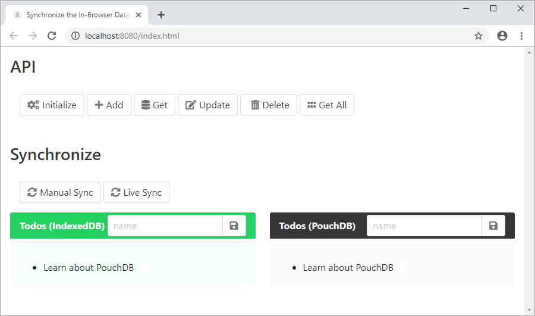

# Synchronize IndexedDB with CouchDB using PouchDB

Learn about the PouchDB API and how to automatically and manually synchronize data with CouchDB on the server.

## Setup

1. First you need to install <a href="http://couchdb.apache.org/" target="_blank">CouchDB</a> on your machine and have a local instance on port *5984*.

1. Then clone this repo:

    ```bash
    git clone https://github.com/craigshoemaker/synchronize-dbs-demo.git
    ```

1. Switch into the project folder:

    ```bash
    cd synchronize-dbs-demo
    ```

1. Open *public/todos.js* and add the credentials you set up for CouchDB.

1. Install the dependencies:

    ```bash
    npm install
    ```

## Run the app

From the project's root folder, run `npm start`:

```bash
npm start
```

You should now see the application running in your default browser:


